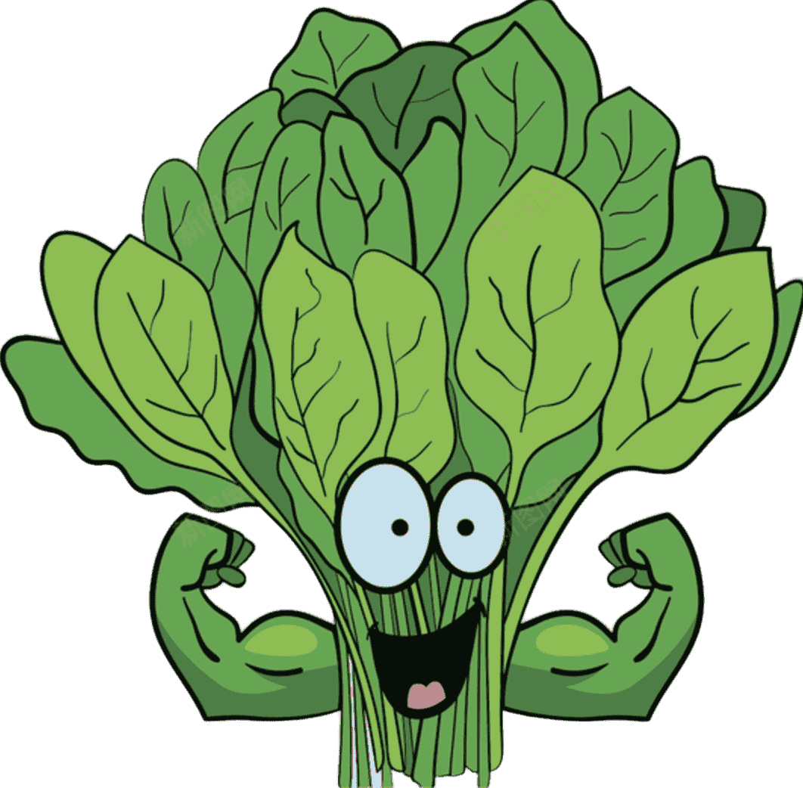

# AI Lottery Number Prediction



English | [简体中文](README.md)

> **Online Training & Prediction:** <https://www.ai-spinach.xyz>  
> **Customer Service:** Group 1 `246714623`, Group 2 `980203303`

## 📖 Introduction

This is a deep learning-based lottery number prediction experiment. **For entertainment purposes only.** Please do not use it for any illegal purposes or excessive betting.

The core of this project is the **predictive power of sequence models**. Unlike traditional approaches that treat each number independently, this project models the red balls as a complete sequence and introduces a **CRF (Conditional Random Field)** layer to capture sequential dependencies between numbers. This effectively avoids duplicate numbers caused by independent prediction and improves the coherence and rationality of the results. The blue ball is predicted by a separate model.

The entire model is built in TensorFlow 1.x compatibility mode and runs under TensorFlow 2.x via the `tf.compat.v1` interface.

## ✨ Features

- Supports Double Color Ball (SSQ), Super Lotto (DLT), Seven Happy (QLC), and Seven Star (QXC)
- Provides an online training & prediction web app, no local deployment required
- Uses an **LSTM + CRF sequence model** to improve red ball prediction coherence
- Supports model evaluation with adjustable train/test split
- Pure script-based execution, no Docker or microservices needed

## 🛠️ Installation

1. Install Anaconda (see [tutorial](https://zhuanlan.zhihu.com/p/32925500))
2. Create a conda environment:
   ```bash
   conda create -n your_env_name python=3.11
   ```
3. Activate the environment and install dependencies:
    ```bash
    conda activate your_env_name
    pip install -r requirements.txt
    ```

## 🚀 Getting Started

1. Fetch Training Data
    ```bash
    python get_data.py --name ssq   # Double Color Ball
    ```
    If parsing fails, check whether http://datachart.500.com/ssq/history/newinc/history.php is accessible.

    Other lottery types:    

    | name | args         |
    |------|--------------|
    | Super Lotto  | `--name dlt` |
    | Seven Happy  | `--name qlc` |
    | Seven Star  | `--name qxc` |

2. Train Models
   ```bash
   python run_train_model.py --name ssq
   ```
   The red ball model is trained first, followed by the blue ball model. Model parameters and hyperparameters are configured in config.py. Training time depends on the parameters.

3. Predict Numbers
    ```bash
    python run_predict.py --name ssq
    ```
    Prediction results will be printed to the console.

## 📝 Update Log
* Added support for Seven Happy and Seven Star (parameters qlc, qxc)

* Switched crawler to curl_cffi due to anti-bot measures; Python 3.11 is now required

* Launched a web app for online training and prediction without downloading the source code

* Added model evaluation with adjustable train/test split (training ratio > 0.5 recommended)

* Fixed the issue of blue ball prediction exceeding the valid range in Super Lotto

* Fixed data dimension mismatch caused by parameter passing during training

* Added full support for Super Lotto (data crawling, training, prediction) via --name dlt

* Removed Docker and microservices to lower the entry barrier; just run the scripts

* Updated library versions in requirements.txt to resolve most dependency issues

* Changed the red ball model to treat all red balls as a single sequence (LSTM + CRF) instead of independent predictions, avoiding duplicate numbers. Since the CRF layer API requires tf.compat.v1.disable_eager_execution(), the entire model is built and trained in 1.x mode.
